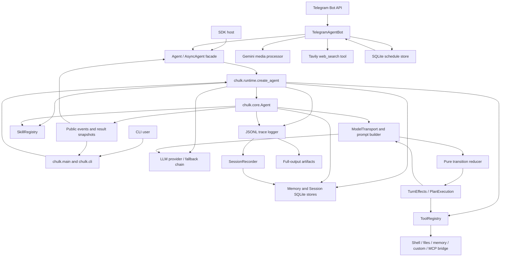

# ChulkHarness Codebase Improvement Plan

Analysis date: 2026-07-24
Repository baseline: `main` at `259ab9ca32b5ce31d6a431d1b0efd7d79ea08a4f`

This document is an implementation roadmap, not an implementation. It is based
on the current tracked repository, targeted static inspection, repository
documentation, and credential-free local validation. Findings are limited to
concrete problems in existing behavior or to safeguards needed before existing
SDK surfaces can be used safely at larger scale.

## 1. Executive Summary

ChulkHarness is a pre-1.0 Python SDK and CLI for running inspectable LLM agents.
Its runtime makes model actions, state transitions, tools, memory, skills,
permissions, sessions, public events, and traces explicit. The public SDK and
CLI share `chulk.runtime.create_agent()`, while provider-specific transports
remain under `chulk/llm/`. The newly pulled baseline also contains an
allowlisted Telegram long-polling adapter, bounded Telegram media
interpretation through Gemini, a bounded Tavily search tool, and a
channel-neutral SQLite scheduler used for Telegram reminders.

The codebase is generally healthy. The orchestration reducer and runtime
services are already separated, SQLite migrations and backups are centralized,
the public SDK has typed results/events/errors, and the offline suite is broad.
On the inspected macOS/Python 3.12 environment, all 1,029 tests passed. Ruff,
documentation checks, and an in-memory syntax compilation of 195 Python files
also passed.

The highest-priority improvements are narrower than a rewrite:

1. Make scheduled-job state transitions claim-owned so cancellation cannot be
   undone by an in-flight worker and an expired lease cannot create concurrent
   execution.
2. Add durable Telegram update idempotency so a failed response delivery does
   not re-run the agent and repeat side effects.
3. Scope memory before allowing multiple Telegram users to share one runtime;
   today prompt injection and memory tools query the same global store.
4. Make multi-file patch application truly all-or-none when a write fails after
   validation.
5. Enforce private filesystem permissions for traces, full-output artifacts,
   and trace exports.
6. Distinguish terminal safety-policy violations from recoverable tool
   failures so a blocked destructive attempt cannot simply continue through the
   ordinary model loop.
7. Close factory-owned provider SDK clients, including the separate Gemini
   media client, and put media calls under explicit timeout/retry policy.
8. Make truncated-output artifacts safely retrievable and trace inspection
   bounded for large traces.

Two developer-facing gaps should be handled alongside that work: the project
currently fails its own `chulk doctor` check because `.chulk/mcp.json` is both
tracked and classified as runtime state, and CI claims OS-independent support
while running only on Ubuntu.

Recommended order: Telegram/scheduler data integrity and memory isolation
first, general file/trace/safety foundations second, provider/trace reliability
third, and cross-platform/configuration cleanup last. Public APIs, Telegram
Bot API behavior, trace envelope version 1, existing SQLite data, provider
action contracts, and CLI/SDK behavior should remain compatible throughout.

Analysis limitations:

- No dependencies were installed or updated, and no live provider or MCP
  request was made.
- The current `chulk` Conda environment is stale relative to
  `environment.yml`: it lacks `pytest-cov` and `mypy`. Therefore the configured
  80% coverage gate and type-check command could not be re-run locally, although
  both are present in CI.
- `python -m compileall` was not run because it writes bytecode; an in-memory
  compile of all tracked Python sources was used instead.
- CI and packaging configuration were inspected but not executed in a clean
  Linux runner or clean wheel environment.
- Telegram, Tavily, Gemini media, hosted LLM, and MCP requests were not made;
  their request shaping and failure behavior were assessed from code and
  credential-free fake-client tests.
- Ignored caches, local SQLite files, traces, and build outputs were treated as
  runtime artifacts, not application source.

## 2. Current Architecture

### Main packages and responsibilities

| Area | Main files | Responsibility |
| --- | --- | --- |
| Public SDK | `chulk/__init__.py`, `chulk/api.py`, `chulk/_sdk/` | Stable constructors, sync/async facades, typed events/results/errors, lifecycle, and compatibility factories. |
| CLI | `chulk/main.py`, `chulk/cli/` | Argument parsing, interactive loop, slash commands, terminal output, doctor/init/trace commands. |
| Runtime assembly | `chulk/runtime.py` | Shared creation of state, stores, skills, tools, provider clients, MCP routing, trace logger, and core agent. |
| Orchestration | `chulk/core/` | Turn state, prompts, action loop, pure reducer, model transport, tool executor, planning, reflection, and turn effects. |
| Providers | `chulk/llm/`, `chulk/llm/providers/` | Provider registry, capabilities, model catalog, structured action transports, usage/cost normalization, fallbacks, and provider clients. |
| Tools and policy | `chulk/tools/` | Tool dataclasses/registry/schema validation, permissions, bounded output, calculator, shell, file, and memory tools. |
| Durable memory | `chulk/memory/` | Memory policy, secret rejection, retrieval/ranking, Markdown import/export, and SQLite memory operations. |
| Sessions/storage | `chulk/sessions/`, `chulk/storage/` | Session snapshots, event-driven persistence, shared SQLite policy, migrations, concurrency, and backup. |
| Skills | `chulk/skills/`, `.chulk/skills/` | Bundled/project playbook discovery, selection, size limits, and prompt injection. |
| Tracing | `chulk/tracing/` | Versioned JSONL traces, full-output artifacts, offline inspect/replay, and HTML export. |
| Telegram adapter | `chulk/telegram/` | Environment-only bot configuration, allowlisted private-chat routing, durable polling cursor, bounded attachments, and outbound Bot API transport. |
| Scheduling | `chulk/scheduling/` | Destination-scoped one-off/interval jobs, SQLite claims/leases, and adapter-bound tools. |
| Bounded web/media integrations | `chulk/tools/web_search.py`, `chulk/llm/providers/gemini_media.py` | Tavily search-only network tool and Gemini in-memory attachment interpretation. |
| Validation | `chulk/tests/`, `typing_tests/`, `scripts/` | Offline unit/integration tests, public typing fixture, docs contract, and wheel-install checks. |

There is no inbound HTTP application server, browser UI, general user-account
system, queue, or external database server in the tracked baseline. Telegram
user authorization is an environment allowlist plus private-chat check.
External integrations are LLM provider APIs, MCP servers, Telegram Bot API,
and optional Tavily search. The Telegram process contains a background
scheduler task; other SDK hosts do not start it unless they opt in.

### Important entry points

- Package API: `from chulk import Agent, AsyncAgent, AgentConfig, ...`
- Programmatic assembly: `chulk.runtime.create_agent()`
- Console script: `chulk = chulk.main:main`
- Telegram console script: `chulk-telegram = chulk.telegram.main:main`
- Module CLI: `python -m chulk.main`
- Trace reader: `chulk.tracing.Trace.from_jsonl()`
- Tool registration: `chulk.tools.ToolRegistry` and public `@Tool`
- Provider creation: `chulk.llm.factory.create_llm_client()`

### Core turn flow

1. The SDK facade or CLI resolves configuration and calls the shared runtime
   builder.
2. The runtime creates the shared SQLite-backed memory/session stores, skill
   registry, trace logger, provider client, and permission-aware tool registry.
3. `chulk.core.Agent` starts a `TurnState`, selects memory and skills, and asks
   `ModelTransport` to build context and request a validated action.
4. `chulk.core.transitions.reduce_transition()` maps the immutable control
   snapshot plus a model/tool/reflection signal to an explicit effect.
5. `ActionLoopRuntime` applies the effect through `TurnEffects`,
   `PlanExecution`, or `ToolExecutor`, then continues or terminates.
6. Internal trace events are written to JSONL and passed to
   `SessionRecorder`, which persists resumable state in SQLite.
7. The SDK facade projects internal state into immutable public
   `RunResult`/`AgentEvent` values.

The Telegram adapter adds a channel boundary around that same flow:

1. `TelegramClient.get_updates()` long-polls and normalizes supported updates.
2. `TelegramAgentBot` rejects non-allowlisted users and non-private chats.
3. One cached `AsyncAgent` and lock are used per chat; conversation metadata
   restores the latest chat conversation after restart.
4. Attachments are type/size checked, interpreted in memory, and injected as
   explicitly untrusted turn context.
5. The adapter saves a monotonically increasing SQLite cursor after handling
   each update.
6. When scheduling is enabled, a background task claims due jobs, runs their
   prompt through the same chat agent, delivers the response, and completes or
   retries the job.



### Patterns and conventions to preserve

- Validated action dataclasses are the LLM boundary; orchestration does not
  parse provider text.
- Provider-specific request/response behavior stays in `chulk/llm/`.
- Runtime composition remains shared by CLI and SDK.
- The pure reducer remains free of provider, tool, SQLite, callback, trace, and
  concrete `Agent` dependencies.
- Tools, skills, memory, traces, and permissions remain separate concepts.
- Side-effect policy is enforced in Python and model-generated arguments remain
  untrusted.
- SQLite remains the runtime source of truth; Markdown remains interchange
  only.
- Public stable imports and immutable result/event contracts remain small and
  typed.
- Sync and async paths preserve parity without forcing all work through one
  blocking implementation.
- Remote adapters remain explicit opt-ins; scheduling and external network
  access are not silently added to ordinary SDK agents.
- Telegram authorization, tool capabilities, and tool permission decisions
  remain independent controls.

## 3. Development and Validation Setup

### Package and environment management

- Build backend: `setuptools.build_meta`
- Distribution: `chulkharness`
- Import package and CLI command: `chulk`
- Supported Python versions: 3.11, 3.12, and 3.13
- Runtime dependencies: none in the base package
- Optional extras: `openai`, `anthropic`, `gemini`, `providers`, `mcp`, and
  `dev`
- Repository environment: Conda via `environment.yml`, which installs editable
  `.[dev,providers,mcp]`

Verified setup commands found in the repository:

```bash
conda env create -f environment.yml
conda activate chulk
conda env update -f environment.yml --prune
```

### Development and runtime commands

```bash
python -m chulk.main --version
python -m chulk.main --show-config
python -m chulk.main --once "Hello"
chulk-telegram
python examples/00_sdk_quickstart.py
```

The one-shot hosted-provider path requires the corresponding provider
credentials. The quickstart uses an injected scripted client and is
credential-free.

### Tests and static validation

Repository commands:

```bash
python -m pytest
python -m pytest --cov=chulk --cov-report=term-missing
python -m ruff check .
python -m mypy chulk typing_tests
python -m compileall chulk
python scripts/check_docs.py
```

The README uses a slightly narrower Ruff/compile command over `chulk`,
`examples`, and `scripts`; CI runs Ruff over the whole checkout and compileall
over `chulk`. No formatter command or formatter CI gate was found. Ruff is used
as a linter, not as an asserted formatting tool.

Build and clean-wheel commands found in CI:

```bash
python -m build --wheel --outdir dist
python scripts/check_wheel_install.py dist/*.whl --examples-dir examples
```

### Local validation evidence

| Check | Result |
| --- | --- |
| `python -m pytest -p no:cacheprovider` in the `chulk` environment | 1,029 passed in 17.47s |
| `python -m ruff check --no-cache .` | Passed |
| `python scripts/check_docs.py` | Passed: 14 topics, links, exports, boundaries, and trace hygiene |
| In-memory `compile()` over `chulk`, `examples`, `scripts`, and `typing_tests` | 195 Python files compiled |
| `python -m chulk.main doctor` with a configured local model | Failed only because tracked `.chulk/mcp.json` is classified as runtime state |
| Coverage | Not run locally; `pytest-cov` missing from the existing environment |
| Mypy | Not run locally; `mypy` missing from the existing environment |

The missing tools contradict `environment.yml`, which includes them through the
`dev` extra. This is an environment limitation, not evidence that the committed
environment declaration is wrong.

### CI checks

`.github/workflows/ci.yml` defines:

- Test lanes on Ubuntu for Python 3.11, 3.12, and 3.13.
- Full provider/MCP extras and branch coverage on Python 3.11 with an 80% floor.
- Offline tests, compileall, and Ruff on every Python lane.
- A Python 3.11 public SDK type-check job with docs and credential-free
  examples.
- A clean wheel build/install/resource/example-import job.

No deployment or package-publishing workflow was found. Release policy is
documented, but publishing is currently an external/manual operation.
`docs/telegram.md` provides a manual `systemd` service example using an
unprivileged service account, `EnvironmentFile`, restart-on-failure, `UMask=0077`,
`NoNewPrivileges`, and `PrivateTmp`; no checked-in unit file or automated
deployment validates that example.

### Environment-variable groups

The repository documents:

- Provider/model selection and fallbacks:
  `CHULK_LLM_PROVIDER`, `CHULK_MODEL`,
  `CHULK_LLM_FALLBACK_PROVIDERS`
- Provider credentials/endpoints for OpenAI, DeepSeek, local
  OpenAI-compatible servers, OpenRouter, Anthropic, Bedrock, and Gemini
- Runtime paths and policy:
  `CHULK_PROJECT_ROOT`, `CHULK_RUNTIME_DIR`,
  `CHULK_PERMISSION_PROFILE`
- Context/tool/trace bounds and retries:
  `CHULK_HISTORY_LIMIT`, skill limits, observation/stdout/stderr limits,
  `CHULK_TRACE_MAX_PROMPT_CHARS`, reflection attempts, provider timeout, and
  provider retries
- Telegram authorization and polling:
  `CHULK_TELEGRAM_BOT_TOKEN`, `CHULK_TELEGRAM_ALLOWED_USER_IDS`,
  polling/retry timing, timezone, scheduling opt-in/poll timing, and attachment
  byte limit
- Telegram web search:
  `CHULK_TAVILY_API_KEY`, `CHULK_WEB_SEARCH_MAX_RESULTS`

`.env` is ignored and `.env.example` contains no real credentials.

## 4. Findings Summary

| ID | Area | Finding | Severity | Effort | Risk | Priority |
| -- | ---- | ------- | -------- | ------ | ---- | -------- |
| REL-003 | Scheduling | Running jobs have no claim ownership; completion can revive a cancelled recurring job or overwrite a newer claim | High | Medium | High — schema/state-machine changes affect recovery and delivery semantics | Required |
| REL-004 | Telegram delivery | A failed response send leaves the cursor behind and re-runs the whole agent turn, including non-idempotent tools | High | Large | High — durable inbox/outbox ordering must avoid lost updates and false acknowledgements | Required |
| SEC-003 | Memory/Telegram | Multiple allowlisted chats share one unscoped long-term memory store and prompt-selection path | High | Large | High — migration and every query path must remain scope-safe | Required for multi-user Telegram |
| REL-001 | File tools | Multi-file patch writes are only atomic during validation, not during commit failure | High | Medium | Medium — rollback and filesystem edge cases must be correct | Required |
| SEC-001 | Tracing | Sensitive traces, artifacts, and HTML exports do not enforce private filesystem modes | High | Medium | Medium — permissions vary by OS and some hosts may rely on group access | Required |
| SEC-002 | Safety policy | Fatal safety blocks are normalized as recoverable tool failures and can re-enter the model loop | High | Medium | High — incorrect classification could terminate legitimate recoverable denials | Required |
| REL-002 | Provider/media lifecycle | Factory-owned provider wrappers and the separate Gemini media client lack deterministic sync/async cleanup; media calls do not inherit configured timeout/retry policy | Medium | Medium | Medium — ownership, async-loop, and provider timeout semantics must remain compatible | Recommended |
| TRACE-001 | Trace artifacts | Truncated output is persisted but lacks a safe retrieval path, while trace reads are whole-file and unbounded | Medium | Medium | Medium — artifact access must not weaken trace secrecy or path containment | Recommended |
| TEST-001 | CI/platforms | OS-independent behavior is claimed, but CI runs only on Ubuntu and Windows branches are unverified | Medium | Medium | Low — additional CI can expose latent portability failures | Recommended |
| DX-001 | Configuration | The repository fails its own doctor check because tracked MCP configuration is treated as forbidden runtime state | Medium | Small | Low — the config/state boundary must be decided explicitly | Recommended |

No Critical finding was verified. In particular, this analysis does not claim a
known remote exploit, Telegram allowlist bypass, SQL injection, or an observed
production disclosure. SEC-003 is a verified missing isolation boundary based
on code paths; no live multi-user deployment data was inspected.

## 5. Detailed Findings

### `[REL-003] Make scheduled-job transitions claim-owned and cancellation-safe`

**Category:** Reliability, data integrity, and background execution.

**Severity:** High.

**Priority:** Required.

**Affected areas:**

- `chulk/scheduling/models.py`
  - `ScheduledJob`
- `chulk/scheduling/store.py`
  - `SQLiteScheduleStore.claim_due()`
  - `cancel()`
  - `complete()`
  - `fail()`
- `chulk/storage/migrations.py`
  - `_migrate_to_scheduled_jobs()`
- `chulk/telegram/bot.py`
  - `_scheduler_loop()`
  - `run_due_jobs_once()`
- `chulk/tests/test_scheduling.py`
- `chulk/tests/test_telegram_bot.py`
- `TODO.md`
- `docs/telegram.md`

**Evidence:**

`claim_due()` changes selected rows to `status='running'` and sets only a
`lease_until` timestamp. The schema and returned `ScheduledJob` have no claim
owner or attempt token. `complete(job_id)` then reads and updates a row using
only its id, without checking that it is still running or that the caller owns
the current lease.

`cancel()` explicitly permits cancellation of a running job and sets its status
to `cancelled`. If that worker later calls `complete()`, a recurring job is set
back to `active`, undoing the user's cancellation. Similarly, after a lease
expires and another worker reclaims a long-running job, the stale first worker
can still complete or reschedule the newer claim.

`fail()` overwrites `next_run_at` with a retry timestamp. A later successful
`complete()` advances recurring cadence from that retry timestamp, so a failure
changes the schedule anchor even though the roadmap and docs say recurring jobs
advance from scheduled time without drift.

`TODO.md` marks recoverable leases and no-drift recurrence complete. The
implemented happy path satisfies those checks, but the cancellation/stale-owner
and failure-retry paths above mean those acceptance items are not yet complete
under concurrency and transient failure.

Finally, `_scheduler_loop()` has no exception boundary around
`run_due_jobs_once()`. An unexpected SQLite/runner exception terminates the
background task while Telegram polling continues; `run_forever()` does not
monitor or restart the task. Existing scheduling tests cover normal
claim/complete, destination-scoped cancellation of an active job, and one
successful delivery. They do not cover cancellation during execution, lease
expiry with two workers, stale completion, retry cadence, or a dead scheduler
task.

**Problem:**

The lease identifies a time window but not the worker authorized to transition
the job. State changes are therefore vulnerable to stale workers, and the
adapter can silently stop executing reminders while appearing healthy.

**Practical impact:**

- A cancelled recurring reminder can become active again.
- One prompt can execute concurrently after a lease expires.
- A stale worker can overwrite the outcome of a newer attempt.
- A single unhandled store error can permanently stop reminders until process
  restart.
- Recurring jobs drift after a transient failure.

**Recommended improvement:**

Add an opaque claim/attempt token (and, if needed, a lease owner) assigned
atomically by `claim_due()`. Require the token and `status='running'` for
`complete()`, `fail()`, and lease renewal. Make cancellation terminal for that
claim, preserve a separate recurrence anchor across retries, and supervise the
scheduler loop with bounded retry/logging. If execution may exceed the lease,
renew it while the agent turn and delivery are active.

Do not attempt exactly-once external delivery in this unit; keep delivery
at-least-once and document the remaining send/ack crash window.

**Behavior that must remain unchanged:**

- Scheduling remains disabled by default and adapter opt-in.
- Jobs stay destination-scoped.
- One-off and fixed-interval public behavior and current tool names/schemas.
- Timezone parsing and minimum recurrence interval.
- Expired claims remain recoverable after a real worker crash.
- Recurrence advances from the intended schedule rather than accumulating
  execution-duration drift.

**Implementation outline:**

1. Add a forward-only migration for claim token and recurrence anchor fields.
2. Return claim identity with each claimed job.
3. Make complete/fail/renew conditional atomic updates over id, token, and
   running status.
4. Treat a zero-row transition as a stale/cancelled claim, not success.
5. Preserve the cadence anchor separately from transient retry time.
6. Renew leases or bound execution so an active worker cannot be reclaimed.
7. Catch and report scheduler-iteration failures, retry with bounded delay, and
   make task death visible to the owning process.

**Validation approach:**

- Cancel a running recurring job, then attempt stale completion; assert it
  remains cancelled.
- Let worker A's lease expire, claim with worker B, then complete/fail with A's
  token; assert no state change.
- Exercise two simultaneous claimers and assert one owner per attempt.
- Renew an active lease and assert no duplicate claim.
- Fail then succeed a recurring job and assert its cadence anchor is preserved.
- Inject a store exception into one scheduler iteration and prove the next
  iteration still runs.
- Cover restart/expired-lease recovery, one-off jobs, and destination isolation.
- Run scheduling, Telegram, SQLite migration/concurrency, full tests, Ruff,
  mypy, docs, and compile checks.

**Risks and mitigation:**

Schema and state-machine changes can strand legacy running rows or make jobs
unclaimable. Back up before migration, normalize legacy running rows to
recoverable state, use conditional SQL transitions, and test with two store
instances. Keep external send semantics explicit rather than claiming
exactly-once delivery.

**Dependencies:** None.

**Acceptance criteria:**

- Cancellation of a running job is never undone by that worker.
- Only the current claim owner can complete, fail, or renew a job.
- A live, renewed claim cannot be executed concurrently.
- Expired claims are still recoverable after a crash.
- Retry timing does not change the recurrence anchor.
- A recoverable scheduler-iteration error cannot silently kill the background
  scheduler.

### `[REL-004] Deduplicate Telegram updates before re-running side effects`

**Category:** Reliability, idempotency, and integration correctness.

**Severity:** High.

**Priority:** Required.

**Affected areas:**

- `chulk/telegram/bot.py`
  - `poll_once()`
  - `handle_update()`
  - `_dispatch()`
  - `_save_offset()`
- `chulk/telegram/client.py`
  - `TelegramUpdate`
  - `send_message()`
- `chulk/sessions/sqlite_store.py`
  - adapter cursor persistence
- `chulk/storage/migrations.py`
- `chulk/tests/test_telegram_bot.py`
- `chulk/tests/test_sessions.py`
- `docs/telegram.md`

**Evidence:**

`poll_once()` calls `handle_update()` and advances the durable cursor only after
the handler returns. This correctly avoids acknowledging an undelivered reply,
but `handle_update()` runs the agent before its final `_send()`. If the model or
a tool completes and Telegram delivery then raises `TelegramError`, the cursor
does not advance. Telegram redelivers the same update and the adapter executes
the full agent turn again.

The default Telegram agent can include the non-idempotent `schedule_task` tool
when scheduling is enabled. A prompt can therefore create a reminder
successfully, fail while sending the textual reply, and create a duplicate
reminder on redelivery. The same issue applies to any future adapter-enabled
side effect. `extension_metadata` records the chat id and source, but not the
Telegram update id, and there is no durable processed-update or response-outbox
record.

The Telegram guide acknowledges at-least-once redelivery if a process fails
after sending but before saving the cursor, but it does not distinguish reply
duplication from re-executing the agent and its tools. Existing tests cover
successful cursor advancement and restart, not send failure after a completed
turn.

**Problem:**

Transport acknowledgement and agent execution are coupled only by a cursor.
The adapter cannot retry delivery without also retrying model/tool side
effects.

**Practical impact:**

- Non-idempotent tools can run twice for one Telegram update.
- Duplicate turns and provider cost can accrue after transient send failures.
- Conversation history can contain repeated user messages and answers.
- Operators cannot tell whether a redelivery is a delivery retry or a new
  execution.

**Recommended improvement:**

Introduce a small durable adapter-update record keyed by
`(adapter, update_id)`, with chat identity, processing status, linked
conversation/turn, bounded/redacted response payload or outbox reference, and
delivery status. Claim an update before execution, execute the agent at most
once, persist the final response before sending, and on redelivery retry only
delivery. Advance the polling cursor when the durable handling policy says the
update is safely recorded, not merely when an in-memory call returns.

This cannot guarantee exactly-once Telegram delivery across a crash after
`sendMessage` succeeds but before local delivery acknowledgement. Preserve and
document that at-least-once send window; the required guarantee is at-most-once
agent/tool execution per update.

**Behavior that must remain unchanged:**

- Unauthorized and unsupported updates are ignored and eventually advanced.
- Supported updates remain ordered within each chat.
- Per-chat locking and conversation resume behavior.
- Telegram replies remain split at the Bot API text limit.
- User-facing transport failures stay sanitized.
- No inbound webhook or public server is introduced.

**Implementation outline:**

1. Define durable update states and retention policy.
2. Add a migration and conditional claim keyed by adapter/update id.
3. Include update id in turn metadata and persist the turn/response linkage.
4. Persist the response/outbox state before delivery.
5. On redelivery, skip agent execution and resume pending delivery.
6. Handle stale in-progress updates using session/turn evidence; block rather
   than blindly replay when a side-effect outcome is uncertain.
7. Advance the monotonic cursor consistently with the durable record.

**Validation approach:**

- Fail the first send after an agent turn that invokes a fake non-idempotent
  tool; redeliver and assert one tool call and one turn.
- Restart between execution, response persistence, send, delivery
  acknowledgement, and cursor persistence.
- Cover unauthorized/group/unsupported updates without unbounded ledger growth.
- Cover two bot processes claiming the same update.
- Cover multi-part reply failure and make duplicate-delivery behavior explicit.
- Run Telegram bot/client/session/migration/concurrency tests and the full
  offline/static suite.

**Risks and mitigation:**

Trying to make the external API exactly-once would create false guarantees.
Separate execution idempotency from delivery idempotency, use a compact state
machine with conditional updates, retain only bounded/redacted response data,
and surface uncertain states for operators.

**Dependencies:** REL-003's claim-token pattern may provide a reusable storage
approach, but the schemas should remain separate.

**Acceptance criteria:**

- One Telegram update can create at most one agent turn and one set of tool
  effects across retry/restart.
- A failed reply send is retried without re-running the model or tools.
- Cursor progression cannot lose an unrecorded supported update.
- The unavoidable post-send/pre-ack duplicate-delivery window is tested and
  documented.

### `[REL-001] Restore all-or-none multi-file patch commits`

**Category:** Reliability and data integrity.

**Severity:** High.

**Priority:** Required.

**Affected areas:**

- `chulk/tools/files.py`
  - `apply_patch()`
  - `_prepare_patch_writes()`
  - `PendingPatchWrite`
- `chulk/tests/test_tools.py`
  - `test_apply_patch_tool_is_atomic_on_multi_file_failure`

**Evidence:**

`_prepare_patch_writes()` validates every target and computes all new content
before mutation. However, `apply_patch()` then loops over `pending_writes`,
creates parent directories, and calls `Path.write_text()` sequentially with no
commit exception handling or rollback.

The existing “atomic” regression test only makes the second patch fail during
preparation because its hunk context is invalid. It proves that validation
precedes mutation; it does not simulate the first write succeeding and a later
write failing because of `OSError`, permission changes, disk exhaustion,
`KeyboardInterrupt`, or `SystemExit`.

**Problem:**

The tool reports an all-files patch operation but can leave a partially applied
workspace when commit-time I/O fails. This is especially risky because
`apply_patch` is the preferred model-facing edit tool.

**Practical impact:**

- A repository can be left in a state that matches neither the old nor the new
  patch.
- A later model iteration may reason from partial changes.
- Recovery is manual and may be difficult for newly created files/directories.
- Existing tests give stronger confidence than the commit path warrants.

**Recommended improvement:**

Implement a small transactional commit helper. Pre-write validated content to
private sibling temporary files, preserve enough original state to restore
modified targets, atomically replace targets where supported, and roll back
every already-committed target on any `BaseException`. Clean up temporary files
and newly created empty directories best-effort without hiding the original
failure.

Do not broaden the patch grammar to deletion, rename, copy, or arbitrary binary
files in this change.

**Behavior that must remain unchanged:**

- Unified-diff syntax and current create/modify support.
- Project-root and sensitive-path checks.
- UTF-8 and size limits.
- Existing success metadata, hashes, and file ordering.
- No deletion/rename support.
- Model-facing failures remain structured `ToolResult` values where recovery is
  possible.

**Implementation outline:**

1. Add a commit helper operating on `PendingPatchWrite`.
2. Stage each new file body without altering targets.
3. Snapshot original existence/content and relevant mode information.
4. Commit replacements in deterministic order.
5. On `BaseException`, restore every committed target in reverse order and
   remove files created by this patch.
6. Return a structured failure for ordinary I/O errors; re-raise process-control
   exceptions only after rollback.
7. Record rollback outcome in safe metadata without including file contents.

**Validation approach:**

- Keep the existing preparation-failure test.
- Add a two-file test where the second replacement raises `OSError`; assert both
  originals remain exact.
- Add creation-plus-modification rollback coverage.
- Add `KeyboardInterrupt` and `SystemExit` interruption coverage.
- Add a rollback-failure test that preserves the original exception and reports
  incomplete recovery safely.
- Run `test_tools.py`, agent file-tool tests, the full suite, Ruff, mypy,
  docs checks, and compileall.

**Risks and mitigation:**

Atomic replacement behavior differs across platforms and filesystems. Keep temp
files beside targets, avoid cross-filesystem moves, test POSIX and Windows, and
make rollback state explicit. Symlink/non-regular-file behavior should be
validated before staging so the change does not introduce a new traversal or
target-swap path.

**Dependencies:** None.

**Acceptance criteria:**

- A failure after one or more successful target replacements restores all
  pre-patch files byte-for-byte.
- Files created by a failed patch do not remain.
- `KeyboardInterrupt` and `SystemExit` cannot leave a silently partial patch.
- Existing successful patch metadata and public behavior remain compatible.
- Sync and async agent paths observe the same final workspace state.

### `[SEC-001] Enforce private trace and artifact storage`

**Category:** Security and reliability.

**Severity:** High.

**Priority:** Required.

**Affected areas:**

- `chulk/tracing/logger.py`
  - `JSONLTraceLogger.__init__()`
  - `_append_event()`
  - `write_artifact()`
- `chulk/cli/maintenance.py`
  - `export_trace_html()`
- `chulk/config.py`
- `chulk/storage/sqlite.py` as the existing private-mode reference
- `chulk/tests/test_tracing.py`
- `chulk/tests/test_cli_maintenance.py`
- `docs/tracing.md`, `docs/safety.md`

**Evidence:**

The tracing documentation correctly labels traces and truncated-output
artifacts as raw sensitive runtime data. `JSONLTraceLogger` creates directories
with `mkdir()` and files with normal append/`write_text()` operations, without
setting or repairing explicit private modes. HTML export likewise uses
`mkdir()` and `write_text()` without a private-mode step.

The SQLite storage boundary already deliberately enforces `0700` directories
and `0600` database/sidecar/backup files on POSIX. Trace tests validate schema,
redaction, and replay behavior but do not assert file modes or reject
symlink/non-regular destinations.

This matters particularly for the legacy CLI configuration, where
`load_config()` places traces at `<project_root>/traces` instead of below the
SDK’s private `.chulk` directory.

**Problem:**

Trace confidentiality depends on the process umask and parent-directory
permissions rather than an invariant enforced by Chulk. On a permissive host,
raw prompts, tool output, proprietary text, or personal data may be readable by
other local users. This is a missing hardening guarantee, not proof that every
current trace is exposed.

**Practical impact:**

- Sensitive runtime output may receive broader local permissions than SQLite
  state.
- HTML exports can silently weaken the permissions of the source diagnostic.
- Operators cannot rely on one consistent private-state policy.
- Symlink or non-regular destinations need explicit treatment before stronger
  mode guarantees can be claimed.

**Recommended improvement:**

Generalize the private-path primitive currently embedded in
`chulk/storage/sqlite.py`, or add an equivalent tracing-local helper, so trace
directories/artifact directories are private and trace/artifact/export files
are owner-only on POSIX. Reject symlinks and non-regular targets before
permission changes or writes. Document best-effort Windows behavior.

**Behavior that must remain unchanged:**

- Trace paths and JSONL envelope version 1.
- Append-only trace semantics and lazy trace creation.
- Redaction behavior.
- Artifact hashes/count metadata.
- Offline inspect/replay/export output.
- Host ownership of retention and sharing decisions.

**Implementation outline:**

1. Define one narrow private-directory/private-file policy usable by tracing.
2. Create or validate directories without following unsafe symlinks.
3. Open/create trace and artifact files privately and repair overly broad
   existing modes where safe.
4. Apply the same policy to HTML exports by default.
5. Add explicit documentation for non-POSIX behavior and any opt-out required
   for shared operational groups.

**Validation approach:**

- POSIX tests for `0700` trace/artifact directories and `0600` JSONL,
  artifact, and HTML files.
- Tests that repair an existing overly broad regular file.
- Tests rejecting symlink and directory targets.
- Preserve deferred/no-trace behavior.
- Exercise SDK `.chulk/traces` and legacy CLI `traces/`.
- Run trace, CLI maintenance, SQLite policy, and full regression suites.

**Risks and mitigation:**

Some deployments may intentionally use group-readable diagnostics. Decide
whether an explicit host-configured mode is needed rather than retaining an
implicit umask dependency. Avoid importing SQLite-specific migration logic into
tracing; share only the safe filesystem primitive.

**Dependencies:** None.

**Acceptance criteria:**

- Fresh trace directories and files are private on POSIX.
- Existing regular trace files with broad modes are safely restricted.
- Trace and artifact writes reject symlink/non-regular destinations.
- Exported HTML is no more permissive than the default trace policy.
- Paths, schemas, and trace contents remain compatible.

### `[SEC-002] Terminalize fatal safety-policy violations`

**Category:** Security and orchestration correctness.

**Severity:** High.

**Priority:** Required.

**Affected areas:**

- `chulk/tools/registry.py`
  - `ToolFailureKind`
- `chulk/tools/shell.py`
  - `_blocked_reason()`
  - containment and execution-policy failures
- `chulk/core/tool_execution.py`
- `chulk/core/transitions.py`
  - `ToolResultSignal`
  - `_reduce_tool_result()`
- `chulk/core/turn_effects.py`
- Public error/event projection under `chulk/_sdk/`
- Reducer, parity, shell-hardening, public-error, and agent tests

**Evidence:**

An obviously destructive shell command is returned as
`error="blocked_command"` with `failure_kind=USER_BLOCKED`. Missing required
containment is also `USER_BLOCKED`. The reducer treats every failed unplanned
tool result the same and returns `CONTINUE`, causing another model request. For
approved plans, a failed tool may consume the normal step retry budget before
blocking.

Ordinary user permission denial is also `USER_BLOCKED`, so the current type
does not distinguish a recoverable “user did not approve this call” from a
hard safety invariant such as “the command matched a destructive pattern” or
“required containment was absent.”

The roadmap already names this distinction, but no failure kind or reducer
branch implements it.

**Problem:**

Safety-policy violations are fed back into the same recovery loop as ordinary
tool failures. Although each individual blocked command is stopped before
process creation, the turn can continue and the model can try variants. The
public result also cannot cleanly distinguish a fatal safety stop from a normal
denial.

**Practical impact:**

- Repeated unsafe attempts can occur in one turn.
- Plan retries can be spent on actions that policy says must never run.
- Hosts receive weaker safety telemetry than the internal reason supports.
- Future safety policies may accidentally inherit recoverable semantics.

**Recommended improvement:**

Add an explicit fatal safety-policy failure classification and reduce it to a
terminal turn effect. Keep ordinary user denial, unavailable tools, validation
errors, timeouts, and recoverable environment failures on their current paths.
Map the terminal result to the existing public `SafetyError`/failure contract
without exposing raw commands or secrets.

**Behavior that must remain unchanged:**

- Blocked commands never start child processes.
- Permission callbacks can deny a call without necessarily failing the whole
  run.
- Recoverable validation/tool/provider errors remain recoverable.
- Plan retry behavior remains unchanged for genuinely retryable failures.
- Public error payloads remain redacted and typed.

**Implementation outline:**

1. Define the fatal failure kind and the small set of producers allowed to emit
   it.
2. Carry it through `ToolResultSignal`.
3. Add a reducer branch before ordinary plan/no-plan failure handling.
4. Apply a terminal blocked/failed effect exactly once and persist it.
5. Project a stable public safety failure and trace event.
6. Document the distinction between denial and fatal policy violation.

**Validation approach:**

- Reducer unit tests for fatal versus recoverable failures.
- Sync/async parity tests for planned and unplanned turns.
- Assert only one unsafe tool attempt and no subsequent model request.
- Assert no child process starts.
- Assert normal permission denial still returns an observation and can recover.
- Assert session resume does not replay or continue the terminalized action.

**Risks and mitigation:**

Over-classification can make ordinary application policy denials unexpectedly
terminal. Use an allowlisted set of fatal producers and do not infer fatality
from arbitrary error strings. Keep the pure reducer dependent only on the
normalized failure kind.

**Dependencies:** None.

**Acceptance criteria:**

- Destructive-command and required-containment violations terminate the turn
  without another model request.
- Ordinary user permission denial remains recoverable.
- Planned execution does not retry fatal safety violations.
- Sync/async state, traces, sessions, and public errors agree.

### `[REL-002] Close provider transports and bound Gemini media calls`

**Category:** Reliability and resource lifecycle.

**Severity:** Medium.

**Priority:** Recommended.

**Affected areas:**

- `chulk/llm/base.py`
- `chulk/llm/providers/openai.py`
- `chulk/llm/providers/chat_completions.py`
- `chulk/llm/providers/anthropic.py`
- `chulk/llm/providers/gemini.py`
- `chulk/llm/providers/gemini_media.py`
- Provider adapters derived from chat completions
- `chulk/runtime.py`
- `chulk/core/agent.py`
- `chulk/_sdk/facade.py`
- `chulk/telegram/main.py`
- `chulk/telegram/bot.py`
- `chulk/tests/test_agent_lifecycle.py` and provider tests
- `chulk/tests/test_gemini_media.py`

**Evidence:**

Provider wrappers create underlying synchronous and asynchronous SDK clients
(for example OpenAI creates `OpenAI` and `AsyncOpenAI`; Gemini retains both the
main client and `.aio`). None of the built-in wrapper classes defines
`close()` or `aclose()`.

The runtime correctly marks only factory-created top-level clients as owned,
and `CoreAgent.close()` calls `close()` on owned resources. Async facade
`close()` ultimately invokes that synchronous path. Lifecycle tests use a fake
LLM that implements `close()`, proving the generic mechanism but not that any
built-in provider releases its actual transports.

The new `GeminiMediaProcessor` independently creates another
`google.genai.Client`. It has no close method and `TelegramAgentBot.close()`
only closes cached agents. Its `generate_content()` call is run in a worker
thread but is not given `Config.llm_timeout_seconds`,
`Config.llm_max_retries`, or an adapter-specific deadline. Construction in
`chulk.telegram.main` also occurs outside the configuration-error handler, so
a missing Gemini key/package can escape as a startup traceback rather than the
same sanitized configuration exit used immediately above it.

**Problem:**

The lifecycle contract exists at the agent level but stops at provider wrapper
boundaries. Long-lived or repeatedly constructed agents can retain HTTP
connection pools and async transport resources until garbage collection or
process exit. Telegram adds a second unmanaged provider client, and its media
path does not inherit the bounded external-request policy used by the main
Gemini provider.

**Practical impact:**

- Resource warnings or open connectors in host applications.
- Avoidable socket/file-descriptor growth under repeated agent construction.
- Async applications cannot deterministically await provider cleanup.
- Construction-failure cleanup is incomplete for wrappers without `close()`.
- A media request can hold a per-chat lock for an implementation-defined
  provider duration.
- Common media startup misconfiguration can produce an unhandled traceback.

**Recommended improvement:**

Add an explicit optional lifecycle protocol to `LLMClient`, implement ownership
tracking inside provider wrappers, and support both `close()` and `aclose()`.
Factory-created SDK transports should be closed; caller-injected transports
must follow a documented ownership rule. Async facades should await native
async cleanup rather than only invoking sync close in a worker thread. Give
`GeminiMediaProcessor` the same explicit timeout/retry/base-URL configuration
policy as the main provider where supported, make it an owned bot resource,
and normalize its startup configuration failures.

**Behavior that must remain unchanged:**

- Caller-injected top-level LLM clients are not closed by the public facade.
- Close remains idempotent.
- Sync use remains valid for providers with async transports.
- Trace finalization and cleanup ordering remain deterministic.
- Provider request, retry, fallback, and structured-output behavior is
  unchanged.
- Media bytes remain bounded, in memory only, and outside traces/memory/files.
- Attachment errors remain sanitized and attachment context remains untrusted.

**Implementation outline:**

1. Define no-op/default lifecycle methods or a small closeable protocol.
2. Record whether each underlying provider SDK client was created or injected.
3. Implement idempotent sync cleanup and awaitable async cleanup.
4. Update runtime construction-failure cleanup.
5. Update `AsyncAgent` to use the async path.
6. Pass configured timeout/retry/base-URL values into the Gemini media client
   and enforce an adapter-side deadline around processing.
7. Own and close the media processor from the bot/main lifecycle.
8. Map startup media configuration failures to a concise nonzero exit.
9. Preserve aggregate cleanup errors without skipping later resources.

**Validation approach:**

- Inject fake sync and async SDK transports into every provider family.
- Assert owned transports close once on normal, exceptional, and construction
  failure paths.
- Assert injected transports follow the chosen ownership rule.
- Assert async cleanup is awaited and cancellation does not skip it.
- Inject a blocking/failing media client and verify the configured deadline,
  sanitized response, released chat lock, and no retained bytes.
- Verify missing Gemini key/package returns the documented startup exit without
  a traceback.
- Assert trace session finish ordering remains stable.
- Run provider conformance, lifecycle, async, parity, and full tests.

**Risks and mitigation:**

Provider SDKs expose different close shapes and some sync close methods may not
be safe on an active async loop. Normalize through adapter-specific methods and
test each supported dependency version with fakes; do not use reflection as the
only ownership policy.

**Dependencies:** The ownership decision in Section 13.

**Acceptance criteria:**

- Every factory-owned built-in provider releases all owned sync/async
  transports exactly once.
- The Telegram media client is closed and its request duration/retries are
  explicitly bounded.
- Caller ownership remains explicit and tested.
- `AsyncAgent.close()` awaits native async cleanup.
- No request-shaping or public API regression occurs.

### `[TRACE-001] Make full-output artifacts safely usable and trace reads bounded`

**Category:** Reliability, diagnostics, and performance.

**Severity:** Medium.

**Priority:** Recommended.

**Affected areas:**

- `chulk/core/observations.py`
- `chulk/core/prompts.py`
- `chulk/tracing/logger.py`
- `chulk/tracing/reader.py`
- `chulk/tools/files.py`
- `chulk/cli/maintenance.py`
- `chulk/tests/test_tracing.py`
- Tool-observation and trace CLI tests
- `docs/tracing.md`, `docs/tools.md`

**Evidence:**

When stdout, stderr, or the combined observation is truncated,
`format_tool_observation()` writes the full content through
`JSONLTraceLogger.write_artifact()` and includes the filesystem path, character
count, and hash in the model-facing observation. The system prompt tells the
model to inspect an artifact when omitted content is required.

Default file tools deliberately refuse `traces/` and almost all `.chulk/`
runtime paths, so the model cannot use the advertised path. Trace
inspect/replay output does not expose a validated artifact manifest or a safe
bounded reader.

Separately, `Trace.from_jsonl()` reads the entire trace with `read_text()` and
then calls `splitlines()`. Trace files and artifact retention have no
repository-enforced bound. This is a verified scaling characteristic; the
failure threshold was not benchmarked.

**Problem:**

The runtime pays the storage cost of full output but does not provide a safe
way to consume it. Operators and agents receive contradictory guidance, and
large long-lived traces must be materialized fully in memory for inspection.

**Practical impact:**

- Critical tail/middle evidence may be unavailable to the model after
  truncation.
- Users may bypass safeguards by manually reading raw trace paths.
- Artifact tampering/staleness is not checked against the recorded hash.
- Very large traces can cause avoidable memory spikes in offline commands.
- Artifact retention can grow without an inspectable inventory.

**Recommended improvement:**

Add an opaque, ownership-checked artifact reference and a dedicated bounded
artifact reader. Resolve only references recorded for the current
conversation/turn, reject path traversal and symlinks, validate size/hash, and
return bounded slices or head/tail previews. Extend trace inspect/export with an
artifact manifest. Parse JSONL incrementally and allow explicit limits for
events/bytes while preserving a deliberate override for trusted offline use.

**Behavior that must remain unchanged:**

- Model-facing observation limits.
- Raw artifacts remain sensitive and unavailable through general file tools.
- Trace envelope version and existing JSONL files.
- Offline replay remains non-executing.
- Existing trace summary/replay keys remain compatible.

**Implementation outline:**

1. Replace raw model-facing paths with an opaque artifact id plus safe metadata,
   retaining paths in trace-only metadata if needed.
2. Build an artifact resolver bound to trace/conversation ownership.
3. Add bounded read operations and integrity validation.
4. Include artifact manifests in inspect/HTML export without embedding full
   content by default.
5. Stream trace parsing line-by-line and add configured safety limits.
6. Define retention reporting before automatic deletion.

**Validation approach:**

- End-to-end tool output larger than every configured bound.
- Successful bounded artifact read by recorded id.
- Reject forged id, wrong conversation, traversal, symlink, oversized, missing,
  and hash-mismatched artifact.
- Assert general `read_file` still rejects traces.
- Parse a large generated trace with bounded memory or an explicit event limit.
- Assert old v0/v1 traces still inspect and replay identically.
- Golden tests for artifact manifest output.

**Risks and mitigation:**

Artifact access is a new sensitive boundary. Keep it narrower than general file
access, require host capability/permission, never trust the model-provided
path, and avoid returning full content by default. Introduce parser limits with
clear errors so existing large-trace workflows are not silently truncated.

**Dependencies:** SEC-001 should define the filesystem safety primitive first.

**Acceptance criteria:**

- A model or host can retrieve necessary truncated evidence through a bounded,
  ownership-checked interface without general trace access.
- Tampered or cross-conversation artifacts fail closed.
- Inspect/export surfaces list artifacts and integrity status.
- Large traces are parsed incrementally with explicit limits.
- Existing trace replay output remains compatible.

### `[SEC-003] Isolate long-term memory across Telegram users and host scopes`

**Category:** Security, data isolation, and persistence.

**Severity:** High.

**Priority:** Required for multi-user Telegram; recommended for single-user
SDK hardening.

**Affected areas:**

- `chulk/storage/migrations.py`
- `chulk/memory/models.py`
- `chulk/memory/sqlite_store.py`
- `chulk/memory/policy.py`
- `chulk/tools/memory.py`
- `chulk/runtime.py`
- `chulk/_sdk/config.py`
- `chulk/telegram/config.py`
- `chulk/telegram/bot.py`
- Memory public snapshots if scope provenance is exposed
- Memory, migration, concurrency, public API, and session tests
- `docs/memory.md`, `docs/configuration.md`, `docs/safety.md`

**Evidence:**

The `memories` and `memory_tags` schema has no user, workspace, tenant, or
namespace column. Search, tag search, profile retrieval, list, update, archive,
delete, import/export, duplicate detection, and vector reranking operate over
all memories in the configured database.

`select_memories_for_prompt()` calls global profile and relevant searches. The
Telegram adapter accepts a plural, comma-separated user allowlist and creates
one agent per chat, but every agent is assembled against the same
`config.store_path`. Its `Capabilities(memory=READ_ONLY)` still enables prompt
retrieval, and its default tools explicitly include `search_memory`,
`list_memories`, and `summarize_memories`. Read-only prevents mutation; it does
not restrict which records are read.

Conversation rows and scheduled jobs are chat/destination-scoped, but memory
records are not. Therefore two allowlisted Telegram users in one bot process
can receive the same global profile/relevant memories in prompts and can query
the same records through memory tools. The repository does not contain a
two-user isolation test or a Telegram warning that memory is shared.

**Problem:**

A host that reuses one runtime directory for multiple users or workspaces will
mix durable profile/project memory. The new Telegram adapter makes that
configuration directly reachable through its documented multi-user allowlist.
Retrofitting scope touches every query, FTS path, proposal, import/export, and
migration.

**Practical impact:**

- Easy host misconfiguration can cause unrelated memory to enter prompts.
- One allowlisted Telegram user can receive or explicitly list memories
  associated with another user or with the server operator.
- Profile memories are especially likely to cross conversational boundaries.
- Deletion/export cannot be scoped safely inside one shared store.
- Future retention/consolidation behavior cannot be correct without a stable
  isolation key.

**Recommended improvement:**

Add one explicit, validated namespace key to memory and proposal records through
an additive migration. Backfill existing records to a compatibility default.
Bind a scoped store/policy at runtime so every read and mutation requires the
same scope internally. Preserve unscoped public calls by mapping them to the
default namespace during the compatibility period.

Until that migration exists, the smallest safe bridge is to reject a
multi-user Telegram allowlist when memory retrieval/tools are enabled, or
disable Telegram long-term memory entirely for multi-user mode. Do not imply
that per-chat conversation storage also scopes long-term memory.

Do not add semantic contradiction resolution, cross-namespace search, or a
remote vector database in this change.

**Behavior that must remain unchanged:**

- Existing single-project stores continue to work without manual migration.
- Memory modes (`off`, `read-only`, `manual`, `automatic`) remain unchanged.
- Secret rejection, provenance, ranking, archive/restore, and proposal review
  semantics remain intact.
- Markdown remains interchange only.
- Current public calls continue to operate in the default namespace.

**Implementation outline:**

1. Decide namespace source and normalization rules.
2. Add an ordered migration and indexes; backfill a default scope atomically.
3. Add namespace to memory/proposal models.
4. Bind namespace once in runtime assembly.
5. Bind Telegram agents to a stable user/chat namespace and prevent one user
   from selecting the compatibility/global namespace.
6. Add scope predicates to every memory/proposal/FTS/tag query and mutation.
7. Make duplicate detection, import/export, compaction, and access counters
   scope-local.
8. Add retention policy only after isolation tests are exhaustive.

**Validation approach:**

- Migration from v0/v1/v2 databases with exact data preservation.
- Two namespaces in one database with identical content/tags; assert no
  retrieval, update, proposal, export, or delete crossover.
- Two allowlisted Telegram users with distinct memories; assert prompt
  selection and every exposed memory tool stay within the chat/user scope.
- FTS, LIKE fallback, vector, profile, duplicate, archive, and import/export
  isolation tests.
- Concurrent writers in different scopes.
- Future-version and rollback/backup tests.
- Full session/resume, memory modes, SDK, and CLI tests.

**Risks and mitigation:**

One missed `WHERE namespace = ?` clause becomes a data-isolation defect. Prefer
a scoped store object that makes unscoped internal access impossible, add
architecture tests/search guards, and complete the migration/query audit before
enabling a public multi-tenant claim.

**Dependencies:** Human decision on namespace identity and compatibility.

**Acceptance criteria:**

- Every memory/proposal operation is scope-local in code and tests.
- Existing databases migrate automatically to the default namespace with a
  validated backup.
- A shared database can hold two namespaces without cross-scope prompt
  injection or mutation.
- Multi-user Telegram either uses enforced namespaces or refuses to start with
  memory enabled.
- Current single-project APIs remain compatible.

### `[TEST-001] Add CI coverage for supported operating-system branches`

**Category:** Testing and release reliability.

**Severity:** Medium.

**Priority:** Recommended.

**Affected areas:**

- `.github/workflows/ci.yml`
- `chulk/tools/shell.py`
- `chulk/tests/test_shell_hardening.py`
- Filesystem permission/patch tests introduced by REL-001 and SEC-001
- Packaging smoke tests
- `pyproject.toml` classifiers and release documentation

**Evidence:**

The package is classified as OS Independent and contains explicit Windows
process-group/termination branches. Comments mark those branches as “exercised
on Windows,” but every current CI job uses `ubuntu-latest`. The local validation
for this audit ran on macOS, not Windows.

Python-version coverage is strong, but version coverage is not OS coverage.

**Problem:**

Windows-specific shell cleanup, path handling, permissions, and atomic replace
behavior can regress without a required check. REL-001 and SEC-001 will add more
platform-dependent filesystem behavior.

**Practical impact:**

- A release may pass all required checks while failing on a claimed platform.
- Process descendants or temporary files may leak on Windows.
- Contributors cannot tell whether “OS Independent” is tested or aspirational.

**Recommended improvement:**

Add one Windows Python 3.12 lane for the credential-free suite, package import
smoke, and platform-relevant tool tests. Keep the existing Linux/Python matrix.
Add macOS CI only if macOS is an explicit supported target rather than relying
on occasional local runs.

**Behavior that must remain unchanged:**

- Existing Linux Python 3.11/3.12/3.13 matrix.
- Offline and credential-free tests.
- Coverage floor remains on one deterministic lane.
- Platform-specific tests may skip only when the underlying behavior truly does
  not exist on that platform.

**Implementation outline:**

1. Define the supported OS statement.
2. Add a Windows 3.12 CI job with the relevant extras.
3. Replace POSIX-only test commands with portable helpers where behavior is
   cross-platform.
4. Keep explicit POSIX-only tests marked and add Windows equivalents.
5. Include wheel install/import smoke.

**Validation approach:**

- Required green Windows job on pull requests.
- Verify shell timeout/overflow descendant cleanup.
- Verify path containment and patch rollback.
- Verify trace private-mode tests make appropriate Windows assertions.
- Verify wheel install and public imports.

**Risks and mitigation:**

New CI may expose genuine failures and increase runtime. Start with one Python
version and do not duplicate the full provider matrix unless evidence warrants
it.

**Dependencies:** Coordinate with REL-001 and SEC-001 so their new behavior is
covered on both platforms.

**Acceptance criteria:**

- At least one required Windows CI lane passes the credential-free suite.
- Windows-specific shell/filesystem branches have behavioral coverage.
- Release documentation accurately states the tested platforms.

### `[DX-001] Define the tracked MCP configuration boundary`

**Category:** Developer experience and configuration hygiene.

**Severity:** Medium.

**Priority:** Recommended.

**Affected areas:**

- `.chulk/mcp.json`
- `.gitignore`
- `chulk/cli/maintenance.py`
  - `_gitignore_check()`
  - `_tracked_runtime_paths()`
- `chulk/cli/maintenance.py` initialization behavior
- `chulk/tests/test_cli_maintenance.py`
- `docs/configuration.md`, `docs/mcp.md`, `README.md`

**Evidence:**

The repository intentionally tracks `.chulk/mcp.json`, currently containing a
secret-free DeepWiki MCP server declaration. `.gitignore` ignores all of
`.chulk/`. `chulk doctor` classifies every tracked path below
`config.runtime_dir` as forbidden runtime state.

Running doctor on this clean baseline with a valid local model reports:

```text
[fail] gitignore: runtime paths are already tracked by Git: .chulk/mcp.json
```

The same repository documents `.chulk/mcp.json` as server configuration and
`.chulk/skills/` as project playbooks, while README warns not to commit
`.chulk/` state. The boundary between declarative project configuration and
sensitive runtime state is therefore inconsistent.

**Problem:**

The canonical health command reports the repository itself as unhealthy, and
contributors do not have one trustworthy rule for whether MCP configuration
belongs in Git.

**Practical impact:**

- `chulk doctor` cannot be used as a clean baseline gate here.
- New MCP config changes may be silently ignored or require force-add.
- A blanket exception could accidentally permit secrets/runtime state; a
  blanket prohibition prevents reviewable project configuration.

**Recommended improvement:**

Choose and document one model:

1. Recommended: classify secret-free `.chulk/mcp.json` and `.chulk/skills/` as
   declarative project configuration, narrow doctor to actual state
   (`store.sqlite`, sidecars/backups, traces/artifacts), and use precise
   `.gitignore` allow/deny rules; or
2. Move committed MCP configuration to a non-runtime project path and provide a
   compatibility lookup/migration.

Never allow literal authorization values in committed MCP configuration;
continue using `authorization_env`.

**Behavior that must remain unchanged:**

- Current MCP schema, allowlist, and approval behavior.
- Secrets remain in environment variables, never committed JSON.
- SQLite/traces/artifacts remain ignored and doctor-enforced.
- Existing local `.chulk/mcp.json` installations continue to load during any
  migration period.

**Implementation outline:**

1. Decide whether MCP declarations are project configuration or local-only
   state.
2. Update ignore rules and doctor classification together.
3. Add secret-value validation to any newly trackable config path.
4. Preserve compatibility lookup if the path changes.
5. Update init output and documentation.

**Validation approach:**

- Run `chulk doctor` against the repository and require success with the tracked
  safe config.
- Assert tracked SQLite, trace, artifact, backup, and literal-secret config
  still fail.
- Test new and existing project initialization.
- Test MCP loading from the compatibility path if relocation is chosen.

**Risks and mitigation:**

A broad `.gitignore` negation can expose runtime files. Use narrow patterns and
doctor tests over representative state files. A path migration can break local
setups; support the old path with an explicit precedence rule and warning.

**Dependencies:** Human decision on configuration ownership.

**Acceptance criteria:**

- The repository passes its own doctor check.
- The Git policy distinguishes reviewable MCP/skill configuration from
  sensitive runtime data.
- Runtime databases, traces, artifacts, backups, and real credentials remain
  blocked from Git.
- Documentation and initialization behavior state the same rule.

## 6. Unused or Potentially Stale Code

No file was labeled unused solely because it lacked a direct import. Imports,
tests, public exports, console entry points, resource loading, and runtime
dispatch were checked.

| Candidate | Why it appears stale | Searches/references checked | Dynamic/framework use possible? | Confidence | Next verification |
| --- | --- | --- | --- | --- | --- |
| `chulk.tools.permissions.TerminalPermissionDenied` | Defined and covered by a public error-mapping test, but no production code raises or imports it. Runtime permission denials are `ToolResult` values. | Repository-wide symbol search, public error tests, tool executor, SDK mapper. | Yes. It may be an intentional compatibility seam for custom/internal callers or a future fatal path. | High that there is no current internal producer; low that deletion is safe. | Decide during SEC-002 whether it becomes the normalized terminal exception. Otherwise deprecate/remove it together with its mapper test. |
| Ignored `__pycache__`, `.coverage`, build, wheel, egg-info, local SQLite, and trace artifacts | They are present locally but excluded from Git and are generated by normal development/runtime activity. | `git ls-files`, `git status --ignored`, `.gitignore`, package/CI commands. | Not application code. | High. | Do not treat as source deletion work. Clean only through a separately approved local cleanup task. |

The tracked `.chulk/mcp.json` is not classified as unused; it is actively loaded
and is addressed by DX-001.

The newly added Telegram, scheduling, media, and web-search modules are all
reachable from the `chulk-telegram` console entry point, adapter assembly,
exports, or tests. None was classified as unused. The lack of a top-level
`chulk.__all__` export for adapter-specific APIs is consistent with their
explicit subpackage boundary, not evidence of stale code.

## 7. Testing Gaps

The suite is broad and behavior-oriented, especially around orchestration
parity, providers, SQLite recovery, shell hardening, SDK contracts, and session
resume. The most important missing cases are:

1. **Scheduled-job state races:** no test cancels a running recurring job
   before stale completion, uses two workers across lease expiry, renews a
   lease, preserves recurrence cadence across failure, or proves the scheduler
   survives an iteration exception.
2. **Telegram update idempotency:** no test fails response delivery after a
   completed agent/tool turn and then redelivers/restarts. Multi-part reply
   failure and two-process update claims are also uncovered.
3. **Telegram memory isolation:** no test creates two allowlisted chats with
   distinct memories and checks both automatic prompt selection and the exposed
   search/list/summarize tools.
4. **Patch commit failures:** no test fails the second filesystem write after a
   first write has committed, and no interruption/rollback-failure coverage
   exists.
5. **Trace confidentiality:** no mode, symlink, non-regular destination, or HTML
   export permission tests.
6. **Fatal safety semantics:** reducer/parity tests do not distinguish
   destructive/containment violations from ordinary permission denial.
7. **Real provider/media lifecycle:** lifecycle tests use closeable fakes at the
   top-level client boundary but do not prove built-in wrappers close their
   underlying sync/async SDK clients. The single Gemini media test covers only
   a successful request; it does not cover timeout, retry, close, startup
   configuration failure, cancellation, or byte-release behavior.
8. **Artifact consumption:** truncation metadata is tested indirectly, but
   there is no ownership/hash/tamper/traversal/large-artifact end-to-end read
   path.
9. **Memory store isolation:** no two-scope same-database tests exist because the
   schema has no namespace.
10. **Operating systems:** CI has no Windows lane despite Windows-specific shell
   code and OS-independent package metadata.
11. **Repository health:** doctor behavior is tested in temporary repositories,
   but no check asserts that the real repository’s committed safe configuration
   passes its own policy.
12. **Local validation reproducibility:** the checked-out Conda environment lacks
   two tools declared by `environment.yml`. Recreate/update the environment
   before using local coverage or mypy results as release evidence.

Live provider tests are intentionally absent from the required suite. That is a
reasonable design: unit tests should stay credential-free. Optional
account-owned smoke tests may exist outside required CI, but they should not
replace request-shaping fakes or provider conformance tests.

## 8. Security and Reliability Review

### Existing strengths

- Model actions and tool arguments are schema-validated.
- File tools resolve paths under the project root and reject sensitive/runtime
  paths by default.
- Shell commands have timeouts, live stdout/stderr bounds, process-group
  termination, destructive-pattern checks, and a host containment seam.
- Permission policy and capabilities are explicit and traced.
- Common credential forms are redacted, and durable memory rejects
  credential-like payloads.
- SQLite uses foreign keys, WAL, busy timeouts, explicit transactions,
  forward-only migrations, validated online backups, private modes, and
  concurrency tests.
- Resume logic fails closed around unresolved tool intent and uncertain hosted
  MCP requests.
- Provider requests have configured timeouts/retries and normalized error
  categories.
- MCP credentials are referenced by environment variable rather than embedded
  in the tracked configuration.
- Telegram rejects non-allowlisted users and group chats before creating an
  agent, uses outbound polling rather than an inbound public server, sanitizes
  transport failures, and keeps the token in environment configuration.
- Telegram attachment type policy runs before download, download reads are
  byte-bounded, media remains in memory, and extracted content is explicitly
  marked as untrusted turn context.
- Tavily search is a network-permission tool with bounded query/result content,
  explicit timeout, no arbitrary URL fetch, and source URLs in its result.
- Scheduling is disabled by default, destination-bound, and uses a transaction
  to claim a due batch.

### Verified concerns

- **Scheduled-state consistency:** REL-003 allows stale completion to override
  cancellation/newer claims and lacks a supervised runner failure boundary.
- **Adapter idempotency:** REL-004 can re-run agent/tool effects after a
  response-delivery failure.
- **Memory isolation:** SEC-003 exposes one unscoped store to all allowlisted
  Telegram chats.
- **File data consistency:** REL-001 is a real partial-write window after patch
  validation.
- **Sensitive logging:** SEC-001 is a missing filesystem confidentiality
  invariant for raw traces/artifacts/exports.
- **Safety control flow:** SEC-002 allows hard safety blocks to flow through
  normal recovery semantics.
- **Resource recovery and deadlines:** REL-002 leaves provider SDK/media
  transport cleanup to garbage collection and does not explicitly bound the
  Gemini media request with configured timeout/retry policy.
- **Artifact access and retention:** TRACE-001 stores full sensitive output
  without a safe consumption/inventory path.
- **Configuration hygiene:** DX-001 makes safe declarative MCP configuration
  indistinguishable from forbidden state to doctor/Git rules.

### Areas reviewed without a verified vulnerability

- The SDK/CLI has no general account system; host applications own user
  authentication. The Telegram adapter does have a concrete authorization
  boundary: numeric allowlist plus private-chat enforcement. No bypass was
  found in the normalized update path.
- SQLite queries observed in memory/session stores use parameters for data.
  Dynamic SQL fragments are constructed from internal fixed clauses, not raw
  model text.
- External provider/MCP content remains untrusted and permission-gated; no live
  endpoint testing was performed.
- Web-search URLs are accepted only from Tavily results and are not fetched by
  the tool. `_is_public_web_url()` checks scheme/netloc but not IP class; that
  is not currently an SSRF path because Chulk never requests the returned URL.
- Default custom redaction failure behavior can be configured fail-closed.
  Whether fail-closed should become the default is a product compatibility
  decision, not a vulnerability asserted by this audit.
- File and trace paths still deserve normal local-attacker threat-model review,
  especially around symlink swaps, but no exploit claim is made beyond the
  concrete missing checks described above.

## 9. Performance Review

No runtime benchmark or production profile was available, so this plan avoids
micro-optimization claims.

Evidence-based scaling observations:

- `Trace.from_jsonl()` materializes the complete file and all split lines.
  Traces are append-only and have no enforced retention bound. This is included
  in TRACE-001 because it can become both a memory and operability problem.
- Full-output artifacts are retained without an inventory/retention command.
  Automatic deletion should not be added before ownership and integrity are
  explicit.
- Vector memory search loads at most 1,000 active records and scores them in
  Python. That is a deliberate bound and no measured bottleneck was found.
  Benchmark representative store sizes before proposing a vector database or
  cache.
- `SQLiteScheduleStore.complete()` advances an overdue recurring job with a
  Python `while` loop, one interval at a time. With the tool-enforced minimum
  interval of 60 seconds this is bounded for normal recent jobs, but imported
  or long-dormant records can require many iterations. Replace it with
  arithmetic advancement as part of REL-003 only after preserving exact
  boundary behavior with tests.
- Telegram holds one per-chat lock for the whole media interpretation, agent
  turn, and command dispatch. This intentionally serializes a chat, but an
  unbounded media provider call can head-of-line block that chat; REL-002's
  explicit deadline addresses the verified cause before considering more
  concurrency.
- The scheduler claims at most ten due jobs per poll and processes them
  sequentially. That is a deliberate bounded batch. Measure backlog latency
  before adding concurrency, because parallel execution would complicate claim
  ownership, per-chat ordering, provider budgets, and cancellation.
- List/search methods generally cap result counts, and SQLite lookup paths have
  targeted indexes.
- Provider calls dominate network latency by design. No duplicate provider call
  pattern was verified beyond intended retries, fallback, planning, and
  reflection.

Recommended performance validation before optimization:

- Benchmark trace inspect/replay on 10 MB, 100 MB, and multi-session traces.
- Measure peak RSS, parse time, and limit/error behavior.
- Benchmark memory FTS/vector/profile selection at realistic record counts and
  verify the 1,000-record vector candidate cap remains acceptable.
- Benchmark recurrence advancement after a year of missed one-minute intervals
  before and after REL-003.
- Measure scheduled backlog latency and Telegram per-chat wait time under
  bounded provider delays; do not add concurrent tool execution without
  explicit ordering and cancellation semantics.
- Track provider request counts through existing trace accounting rather than
  adding speculative response caching.

## 10. Recommended Implementation Roadmap

### Phase 1 — Remote-Execution Data Integrity

**Findings:** REL-003, REL-004, and the immediate safe bridge from SEC-003.

**Expected areas:** scheduling models/store/migration, Telegram polling and
scheduler loops, session/update persistence, Telegram memory capabilities,
tests, and adapter documentation.

**Prerequisites:** Decide whether Telegram multi-user identity is user id, chat
id, or an opaque host scope. Decide the durable update/outbox retention window.

**Expected benefit:** Prevents cancelled jobs from reviving, stale/concurrent
workers from overwriting claims, one Telegram update from repeating tool side
effects, and allowlisted users from sharing unscoped memory.

**Estimated scope:** Three reviewable PRs: job state machine, update
idempotency, and immediate memory guard.

**Main risks:** SQLite migration/state-machine mistakes, false exactly-once
claims, and accidentally losing a supported Telegram update.

**Validation checkpoint:** Multi-worker fault injection, send/restart
checkpoints, two-user memory tests, the full 1,029+ suite, 80% coverage, Ruff,
mypy, docs, compileall, and clean wheel.

### Phase 2 — General Safety Foundations

**Findings:** REL-001, SEC-001, SEC-002, and platform coverage from TEST-001.

**Expected areas:** file patch commit, shell/tool failure kinds, reducer/effects,
tracing filesystem code, public error projection, tests, and CI.

**Prerequisites:** Decide the exact fatal-safety producer allowlist and default
trace permission policy.

**Expected benefit:** Removes the general workspace partial-write and local
trace-confidentiality gaps, stops hard safety violations from re-entering the
model loop, and validates OS-dependent behavior.

**Estimated scope:** Three focused implementation PRs plus one CI PR.

**Main risks:** Filesystem rollback correctness, accidental terminalization of
normal denials, and OS-specific mode/replace behavior.

**Validation checkpoint:** Commit-time fault injection, mode/symlink tests,
sync/async parity, full offline/static gates, Linux/Windows CI, and clean wheel.

### Phase 3 — Scoped Memory, Lifecycle, and Diagnostics

**Findings:** full SEC-003 migration/enforcement, REL-002, and TRACE-001.

**Expected areas:** memory schema/models/store/policy/tools, Telegram scope
binding, provider/media lifecycle, runtime/facades, tracing logger/reader,
artifact access, trace CLI, and docs.

**Prerequisites:** SEC-001 private path primitive; namespace compatibility
model; provider ownership decision.

**Expected benefit:** Makes one database safe for explicitly scoped users or
workspaces, deterministically releases provider resources, bounds media calls,
and makes stored diagnostics safely usable.

**Estimated scope:** Large; split memory schema from exhaustive query
enforcement, and keep lifecycle/artifacts in separate PRs.

**Main risks:** One unscoped memory query causing leakage, migration/FTS errors,
async close semantics, and exposing sensitive artifact content too broadly.

**Validation checkpoint:** Migration backup/rollback, exhaustive two-scope
matrix, provider/media lifecycle matrix, artifact tamper/isolation, large-trace
tests, old trace compatibility, and full gates.

### Phase 4 — Configuration and Developer Experience

**Findings:** DX-001 and remaining TEST-001 release-policy alignment.

**Expected areas:** `.gitignore`, MCP config location/classification, doctor,
init, docs, repository health tests, CI/release docs, and any roadmap wording
made obsolete by completed findings.

**Prerequisites:** Human decision on whether MCP/project skills are committed
configuration or local-only state.

**Expected benefit:** A trustworthy doctor command, unambiguous Git hygiene,
and release claims backed by required checks.

**Estimated scope:** Small to medium.

**Main risks:** Accidentally unignoring sensitive runtime data or breaking
existing local MCP paths.

**Validation checkpoint:** Doctor success in the real checkout, tracked-secret
negative tests, init compatibility, required platform CI, docs, and wheel
checks.

## 11. Proposed Implementation Units

### Unit 1 — Claim-owned scheduled-job state machine

- **Related findings:** REL-003
- **Objective:** Make cancellation, expiry, retry, renewal, and completion
  conditional on the current execution claim.
- **Expected files:** scheduling models/store, SQLite migrations, Telegram
  scheduler loop, scheduling/Telegram/storage tests, docs.
- **Explicitly excluded:** Cron syntax, arbitrary background workers, parallel
  agent execution, exactly-once Telegram delivery.
- **Required tests:** Running cancellation, two workers, lease expiry/renewal,
  stale complete/fail, recurrence retry anchor, scheduler iteration recovery,
  legacy migration.
- **Acceptance criteria:** Only the active claim can transition a running job;
  cancellation stays terminal; recurrence does not drift after retry; the
  runner cannot silently die on one recoverable iteration failure.
- **Dependencies:** None.

### Unit 2 — Durable Telegram update execution ledger

- **Related findings:** REL-004
- **Objective:** Execute each supported Telegram update at most once while
  retrying response delivery separately.
- **Expected files:** Telegram bot/client, session or adapter persistence,
  SQLite migration, tests, docs.
- **Explicitly excluded:** Exactly-once Bot API delivery, inbound webhooks,
  arbitrary queues, new Telegram features.
- **Required tests:** Send failure after a non-idempotent tool, restart at every
  processing/delivery checkpoint, concurrent bot claim, multi-part response,
  unsupported/unauthorized update retention.
- **Acceptance criteria:** Redelivery never creates a second agent turn/tool
  effect for the same update; pending replies remain retryable; cursor
  progression cannot lose an unrecorded update.
- **Dependencies:** Unit 1's conditional-claim pattern may be reused.

### Unit 3 — Transactional patch commit

- **Related findings:** REL-001
- **Objective:** Guarantee rollback after commit-time failure.
- **Expected files:** `chulk/tools/files.py`, `chulk/tests/test_tools.py`, small
  agent/parity regressions if needed.
- **Explicitly excluded:** Patch deletion/rename/copy, binary patches, new
  public APIs.
- **Required tests:** Second-write `OSError`, created-file rollback,
  `KeyboardInterrupt`, `SystemExit`, rollback failure, existing success cases.
- **Acceptance criteria:** Failed multi-file patches leave the pre-patch
  workspace exact; successful behavior/metadata is unchanged.
- **Dependencies:** None.

### Unit 4 — Private trace filesystem policy

- **Related findings:** SEC-001
- **Objective:** Apply explicit private modes and safe target checks to traces,
  artifacts, and exports.
- **Expected files:** tracing logger, trace export, shared/private path helper,
  trace and CLI tests, docs.
- **Explicitly excluded:** Artifact retrieval, trace schema changes, retention.
- **Required tests:** POSIX modes, existing mode repair, symlink/non-regular
  rejection, lazy trace behavior, legacy CLI and SDK paths.
- **Acceptance criteria:** Sensitive files are owner-only by default on POSIX
  and unsafe targets fail closed.
- **Dependencies:** None.

### Unit 5 — Fatal safety transition

- **Related findings:** SEC-002
- **Objective:** Stop the turn on explicit fatal safety violations while
  preserving recoverable denials.
- **Expected files:** failure kinds, shell policy outputs, reducer, effects,
  SDK error mapping, tests/docs.
- **Explicitly excluded:** New sandbox backend, custom permission profiles,
  broader destructive-pattern work.
- **Required tests:** Planned/unplanned sync/async terminalization, no second
  model request, ordinary denial recovery, session resume.
- **Acceptance criteria:** Fatal safety producers terminate exactly once and
  never consume normal retry loops.
- **Dependencies:** Human-approved classification list.

### Unit 6 — Built-in provider and media lifecycle

- **Related findings:** REL-002
- **Objective:** Close all factory-owned sync/async provider transports.
- **Expected files:** LLM base, provider adapters, runtime, core/facades,
  Gemini media processor, Telegram main/bot, provider/media/lifecycle tests.
- **Explicitly excluded:** Provider feature additions, retry redesign, model
  switching.
- **Required tests:** Ownership and close counts for OpenAI-compatible, OpenAI
  Responses, Anthropic, Gemini, fallback chains, construction failure, async
  cancellation; media timeout/retry/close and sanitized startup failure.
- **Acceptance criteria:** Owned transports close once; injected ownership is
  documented and honored; media requests inherit an explicit bounded policy
  and release their transport.
- **Dependencies:** Ownership decision.

### Unit 7 — Safe artifact identity and bounded read

- **Related findings:** TRACE-001
- **Objective:** Retrieve recorded truncated evidence without arbitrary trace
  filesystem access.
- **Expected files:** observation metadata, trace logger/reader, a narrow tool
  or host API, runtime registry, tests/docs.
- **Explicitly excluded:** General trace read capability, automatic artifact
  deletion, embedding full artifacts in events.
- **Required tests:** Correct owner, wrong owner, forged/path traversal,
  symlink, missing, oversized, hash mismatch, bounded slice/head/tail.
- **Acceptance criteria:** Recorded artifacts are usable only through validated,
  bounded references.
- **Dependencies:** Unit 4.

### Unit 8 — Streaming trace inspection and artifact manifest

- **Related findings:** TRACE-001
- **Objective:** Bound offline trace memory use and make artifact inventory
  inspectable.
- **Expected files:** `chulk/tracing/reader.py`, trace CLI/export, tests/docs.
- **Explicitly excluded:** Executable replay, provider/tool re-execution,
  automatic retention deletion.
- **Required tests:** Large JSONL, byte/event limits, explicit override, v0/v1
  compatibility, manifest integrity, duplicate helper removal.
- **Acceptance criteria:** Parsing is incremental and limits fail clearly
  without changing compatible replay output.
- **Dependencies:** Unit 7 for the final artifact reference shape.

### Unit 9 — Immediate Telegram multi-user memory guard

- **Related findings:** SEC-003
- **Objective:** Prevent unsafe multi-user Telegram startup before durable
  memory namespaces are available.
- **Expected files:** Telegram config/bot/main, capability assembly, tests/docs.
- **Explicitly excluded:** Memory schema changes and permanent namespace APIs.
- **Required tests:** Single-user memory behavior, multi-user startup with
  memory enabled/disabled, no memory tools or prompt selection in guarded mode.
- **Acceptance criteria:** The adapter cannot expose one global memory store to
  multiple allowlisted users without an explicit safe mode.
- **Dependencies:** Human decision on whether the bridge refuses startup or
  disables Telegram long-term memory.

### Unit 10 — Memory namespace migration and models

- **Related findings:** SEC-003
- **Objective:** Add a compatibility-default namespace to durable memory and
  proposals.
- **Expected files:** migrations, storage tests, memory models, serialization.
- **Explicitly excluded:** Runtime selection UI, TTL, contradiction resolution,
  vector backend replacement.
- **Required tests:** Legacy migration, backup, rollback, future version,
  indexes/FTS rebuild, exact default-scope data preservation.
- **Acceptance criteria:** Existing stores migrate safely and every record has a
  valid namespace.
- **Dependencies:** Namespace identity decision.

### Unit 11 — Scope every memory operation

- **Related findings:** SEC-003
- **Objective:** Make all retrieval and mutation scope-local.
- **Expected files:** memory store/policy/tools, runtime config, SDK surface if
  approved, Telegram scope binding, docs, exhaustive tests.
- **Explicitly excluded:** Cross-scope admin search and remote multi-user
  service features.
- **Required tests:** Two-scope matrix over FTS/LIKE/vector/profile,
  duplicate/update/delete/archive/proposals/import/export/compaction, concurrent
  writers, plus two Telegram users exercising prompt retrieval and all exposed
  memory tools.
- **Acceptance criteria:** No operation can affect or retrieve another scope.
- **Dependencies:** Unit 10.

### Unit 12 — Windows validation lane

- **Related findings:** TEST-001
- **Objective:** Back OS-independent claims with required Windows checks.
- **Expected files:** CI workflow and portability tests/helpers.
- **Explicitly excluded:** Expanding the provider matrix on every OS.
- **Required tests:** Full or justified focused offline suite, shell cleanup,
  patch rollback, path safety, wheel import.
- **Acceptance criteria:** Required Windows Python 3.12 CI passes.
- **Dependencies:** Prefer landing with or before filesystem/safety Units 3–5.

### Unit 13 — MCP configuration versus runtime-state policy

- **Related findings:** DX-001
- **Objective:** Make Git/init/doctor/docs agree on the safe tracked config
  boundary.
- **Expected files:** `.gitignore`, possibly MCP config path, doctor/init,
  tests/docs.
- **Explicitly excluded:** New MCP transports or tool behavior.
- **Required tests:** Real-checkout-equivalent doctor success; tracked database,
  trace, artifact, backup, and credential failures; path compatibility.
- **Acceptance criteria:** Clean repository doctor succeeds without weakening
  runtime/secret protection.
- **Dependencies:** Configuration ownership decision.

## 12. Areas That Should Remain Untouched

Unless separately approved, roadmap implementation should not change:

- Top-level stable public imports in `chulk.__all__`.
- Existing `Agent`, `AsyncAgent`, `AgentConfig`, result, event, and public error
  behavior except additive fields explicitly required by a finding.
- JSONL trace envelope schema version 1 and legacy v0 read compatibility.
- Provider-neutral validated action dataclasses and `complete_action(...)`
  boundary.
- Existing provider request shapes, model catalog values, prices, aliases, and
  lifecycle metadata unrelated to cleanup.
- Telegram Bot API endpoint/method contracts, environment-only token handling,
  allowlist/private-chat authorization, outbound-polling deployment, command
  names, message-size splitting, and sanitized user-facing failures.
- Bounded attachment type/size policy, in-memory byte handling, untrusted
  context wrapping, and Gemini-only media availability unless separately
  approved.
- Tavily search-only semantics, network permission level, result/query bounds,
  no arbitrary URL fetching, and citation-bearing result shape.
- Scheduling disabled-by-default opt-in, destination scoping, public tool
  names/schemas, one-off/fixed-interval behavior, and at-least-once external
  delivery contract.
- SQLite source-of-truth policy, existing user data, migration ordering, backup
  validation, WAL/busy-timeout/foreign-key policy.
- Default SDK read-only capabilities and permission profiles, except the narrow
  fatal-safety classification.
- Current shell direct-execution disclaimer; this plan does not claim to add a
  sandbox.
- Tool schemas and current file patch grammar unless the relevant unit states
  otherwise.
- Skill selection semantics and bundled skill content.
- Plan approval/rejection semantics, plan state serialization, trace ordering,
  and sync/async parity.
- Manual/automatic memory review modes during namespace work.
- CI Python 3.11/3.12/3.13 coverage and clean-wheel validation.
- Later product directions in `TODO.md` such as browsers, subagents, gateways,
  plugins, general automations, or broader multimodal/document tooling.

## 13. Open Questions and Decisions Required

These questions do not block completion of this analysis, but they must be
answered before the relevant implementation unit:

1. **Fatal safety boundary:** Which exact failures are terminal? Recommended:
   built-in destructive-command block, missing required containment, and
   explicit host fatal-policy result. Ordinary permission denial should remain
   recoverable.
2. **Telegram memory identity:** Should private chats be scoped by Telegram
   user id, chat id, or an opaque adapter-owned key? For current private-only
   behavior they are effectively aligned, but use an explicit normalized key
   so future channel types do not silently inherit that assumption.
3. **Pre-namespace Telegram behavior:** Should a multi-user allowlist refuse to
   start while memory is enabled, or should the adapter disable long-term
   memory/tools automatically? Recommended: fail clearly rather than silently
   weakening configured behavior.
4. **Update ledger retention:** How long should processed Telegram update and
   response-outbox records be retained? It must exceed realistic Telegram
   retry/restart windows without storing unbounded raw conversation content.
5. **Scheduled execution lease:** Should the worker renew a lease, derive its
   duration from the model timeout/tool budget, or both? Recommended: opaque
   attempt token plus heartbeat renewal and an operator-visible stale state.
6. **Trace permissions:** Is owner-only the unconditional default, or do some
   supported hosts need an explicit group-readable mode?
7. **Provider ownership:** If a caller manually creates a built-in wrapper and
   injects underlying SDK clients, does closing the wrapper close those
   transports? Recommended: constructor-level ownership flags with
   factory-created defaults owned and injected transports caller-owned.
8. **Media deadlines:** Should media use the main LLM timeout/retry values or
   adapter-specific settings? Recommended: inherit the main provider policy by
   default with an explicit adapter override only if operational evidence
   requires it.
9. **Artifact exposure:** Should safe artifact reads be model-callable,
   host-only, or capability-gated? Recommended: capability/permission-gated,
   bounded, and conversation-owned.
10. **Trace limits:** What default byte/event limit is safe for inspect/replay,
   and how does a trusted operator override it explicitly?
11. **Memory namespace identity:** Is scope supplied as tenant id, workspace id,
   both, or one opaque host-defined key? Recommended: one opaque normalized key
   internally, with richer host identity outside the store.
12. **Memory compatibility:** How long should unscoped public calls map to the
   default namespace before an explicit scope is required for shared stores?
13. **MCP configuration:** Is `.chulk/mcp.json` committed project configuration
   or local-only runtime config? The current repository behaves as the former
   while doctor/ignore rules assume the latter.
14. **Supported operating systems:** Is Windows an officially supported target?
   If not, remove or narrow the OS-independent claim; if yes, make its CI
   required.
15. **Retention:** What trace/artifact and memory retention defaults, if any,
    should Chulk enforce versus merely report? Do not implement automatic
    deletion before ownership/scope is explicit.

Assumptions used by this plan:

- Backward compatibility is preferred over schema/API cleanup.
- The current single-project SDK remains the default use case, but the
  documented plural Telegram allowlist is treated as a real multi-user
  boundary.
- Multi-user memory guarantees should not be advertised until SEC-003 is
  complete or Telegram memory is explicitly disabled/refused.
- Telegram response delivery remains at-least-once; REL-004 targets at-most-once
  agent/tool execution, not impossible exactly-once external messaging.
- Raw traces and artifacts are always sensitive, regardless of common-secret
  redaction.
- No later-phase product feature is needed to complete the first two roadmap
  phases.

## 14. Definition of Done

The improvement initiative is complete only when:

- Every approved finding has an implementation or an explicitly accepted
  documented deferral.
- REL-003 proves cancellation cannot be revived, stale workers cannot
  transition newer claims, active leases cannot be concurrently reclaimed, and
  the scheduler survives recoverable iteration failures.
- REL-004 proves one Telegram update creates at most one agent turn/tool-effect
  set across send failures and restarts while preserving documented
  at-least-once response delivery.
- REL-001 fault injection proves all-or-none workspace state after commit-time
  failures and interruptions.
- SEC-001 establishes and tests private trace/artifact/export storage.
- SEC-002 terminalizes only explicit fatal safety-policy violations and
  preserves ordinary denial recovery.
- REL-002 deterministically closes every factory-owned provider/media transport
  in sync and async hosts and applies explicit media request deadlines/retries.
- TRACE-001 provides bounded, ownership-checked artifact access and incremental
  trace inspection without weakening general file restrictions.
- SEC-003 is complete before multi-user Telegram memory is enabled: migration,
  models, queries, mutations, FTS/vector paths, proposals, import/export,
  concurrency, compatibility, prompt selection, and Telegram memory tools are
  all scope-tested.
- TEST-001 aligns supported OS claims with required CI.
- DX-001 makes the real repository pass `chulk doctor` while keeping runtime
  data and secrets untracked.
- Existing public APIs, serialized contracts, trace compatibility, provider
  transports, and user-visible flows remain compatible unless a separately
  approved migration note says otherwise.
- Required documentation, release notes, and roadmap status are updated only
  after behavior is verified.
- The complete validation gate passes in a freshly synchronized environment:

```bash
python -m pytest --cov=chulk --cov-report=term-missing
python -m ruff check .
python -m mypy chulk typing_tests
python -m compileall chulk
python scripts/check_docs.py
python -m build --wheel --outdir dist
python scripts/check_wheel_install.py dist/*.whl --examples-dir examples
```

- Linux Python 3.11/3.12/3.13, the approved Windows lane, public SDK typing,
  docs/examples, and clean-wheel CI are green.
- No unapproved dependency, public API, trace schema, provider contract, or
  database compatibility change was introduced.
- Any remaining limitations and human-owned operational responsibilities are
  explicit in the docs.

## 15. Implementation Ledger

Implementation branch: `refactor/codebase-improvement-plan`

Base commit: `259ab9ca32b5ce31d6a431d1b0efd7d79ea08a4f`

Decisions adopted for implementation:

- Telegram private chats use the opaque scope `telegram:chat:<chat_id>`.
- Multi-user Telegram startup fails clearly while long-term memory is unscoped;
  the guard is removed only after every memory operation is scope-aware.
- Scheduled executions use opaque claim tokens, bounded leases, and renewal by
  the active worker.
- Built-in fatal safety failures are destructive-command blocks, missing
  required containment, and explicit fatal host-policy results. Ordinary
  permission denial stays recoverable.
- Trace, artifact, and export files are owner-only by default on POSIX.
- Factory-created provider transports are owned by the wrapper; injected
  transports remain caller-owned unless explicitly configured otherwise.
- Media calls inherit the main provider timeout and retry policy.
- Artifact reads are bounded, conversation-owned, and capability/permission
  gated.
- Trace inspection defaults to explicit byte and event limits with a trusted
  operator override.
- Durable memory uses one opaque normalized namespace with a compatibility
  default for existing single-tenant callers.
- Secret-free `.chulk/mcp.json` and `.chulk/skills/` are declarative project
  configuration; databases, traces, artifacts, backups, and literal secrets
  remain forbidden runtime state.
- Windows remains a supported target and receives required Python 3.12 CI.

Git is content-addressed, so an implementation commit cannot contain its own
final hash. Each unit records `this commit` in the same commit as its code and
tests. A final ledger-only commit replaces those markers with exact hashes.

| Unit | Status | Commit | Validation | Deviations | Remaining limitations |
| --- | --- | --- | --- | --- | --- |
| 1. Claim-owned scheduled-job state machine | Completed | This commit | Full suite: 1,036 passed; focused Ruff and compileall passed | None | External Telegram delivery remains intentionally at-least-once |
| 2. Durable Telegram update execution ledger | Pending | Pending | Pending | None | Pending implementation |
| 3. Transactional patch commit | Pending | Pending | Pending | None | Pending implementation |
| 4. Private trace filesystem policy | Pending | Pending | Pending | None | Pending implementation |
| 5. Fatal safety transition | Pending | Pending | Pending | None | Pending implementation |
| 6. Built-in provider and media lifecycle | Pending | Pending | Pending | None | Pending implementation |
| 7. Safe artifact identity and bounded read | Pending | Pending | Pending | None | Pending implementation |
| 8. Streaming trace inspection and artifact manifest | Pending | Pending | Pending | None | Pending implementation |
| 9. Immediate Telegram multi-user memory guard | Pending | Pending | Pending | None | Pending implementation |
| 10. Memory namespace migration and models | Pending | Pending | Pending | None | Pending implementation |
| 11. Scope every memory operation | Pending | Pending | Pending | None | Pending implementation |
| 12. Windows validation lane | Pending | Pending | Pending | None | Pending implementation |
| 13. MCP configuration versus runtime-state policy | Pending | Pending | Pending | None | Pending implementation |
